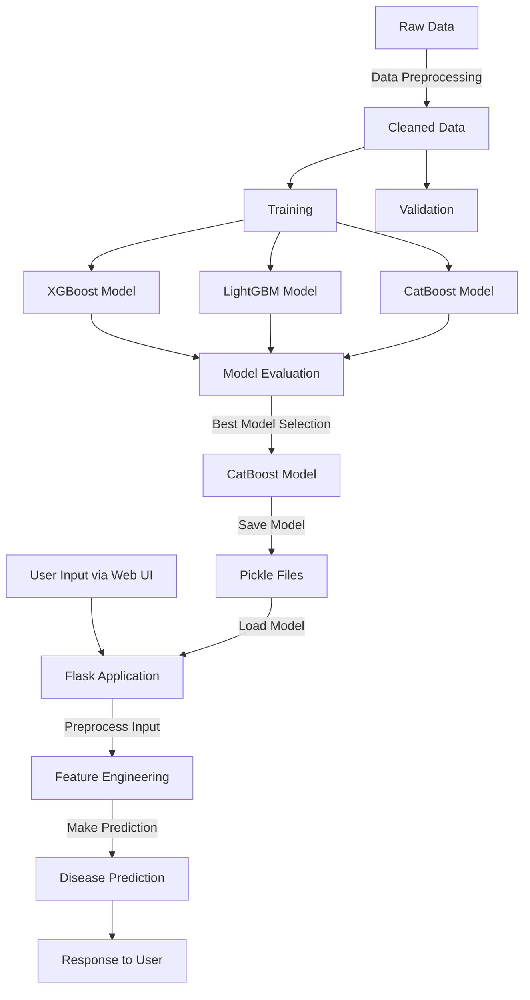

# MediPredict: Disease Prediction System

## Overview

MediPredict is a machine learning-based disease prediction system that diagnoses potential diseases based on patient symptoms. The system was developed as part of a hackathon challenge to demonstrate the application of machine learning in healthcare diagnostics.

The system utilizes gradient boosting algorithms to classify diseases from symptom inputs, with the CatBoost model achieving the highest accuracy. A Flask web interface provides an accessible way for users to input symptoms and receive predictions.

## Project Architecture

The following Mermaid flowchart represents the end-to-end system architecture:



## Project Structure

```
MediPredict_Hackathon/
├── artifacts/               # Generated artifacts during model training
├── config/                  # Configuration files
│   ├── config.yaml          # Project configuration parameters
│   └── environment.yml      # Environment specification
├── data/                    # Data directory
│   ├── processed/           # Preprocessed data
│   │   └── cleaned_data.csv # Cleaned dataset
│   └── raw/                 # Original dataset
│       ├── Testing.csv      # Test dataset
│       └── Training.csv     # Training dataset
├── examples/                # Example scripts
│   └── predict_example.py   # Example prediction script
├── logs/                    # Application logs
├── models/                  # Trained models
│   ├── cat_disease_model.pkl    # CatBoost model
│   ├── label_encoder.pkl        # Label encoder for diseases
│   ├── lgb_disease_model.pkl    # LightGBM model
│   └── xgb_disease_model.pkl    # XGBoost model
├── Notebooks/               # Jupyter notebooks
│   ├── data_preparation.ipynb           # Data cleaning and preprocessing
│   ├── exploratory_data_analysis.ipynb  # EDA visualizations
│   └── model_training.ipynb             # Model development
├── reports/                 # Reports and visualizations
├── src/                     # Source code
│   ├── app.py               # Flask application
│   ├── pipeline.py          # End-to-end pipeline
│   ├── data/                # Data processing modules
│   │   └── preprocess.py    # Data preprocessing functions
│   ├── models/              # Model-related code
│   │   ├── predict.py       # Prediction functions
│   │   └── train.py         # Model training functions
│   └── utils/               # Utility functions
│       ├── config.py        # Configuration utilities
│       ├── helpers.py       # Helper functions
│       └── visualization.py # Visualization utilities
├── static/                  # Static files for web application
│   ├── css/                 # CSS stylesheets
│   ├── js/                  # JavaScript files
│ 
├── templates/               # HTML templates for web interface
│   └── index.html           # Main page template
├── LICENSE                  # License information
├── README.md                # Project documentation
├── requirements.txt         # Python dependencies
└── setup.py                 # Package setup file
```

## Technical Details

### Model Training

The project includes three gradient boosting models trained on the same dataset:

1. **XGBoost**: An optimized distributed gradient boosting library
2. **LightGBM**: A gradient boosting framework that uses tree-based learning algorithms
3. **CatBoost**: A gradient boosting library with support for categorical features

After extensive testing and comparison, the CatBoost model was selected for the production system due to its superior accuracy and robustness for this particular problem domain.

### Web Application

The web interface is built using:
- **Flask**: Backend API and request handling
- **HTML/CSS/JavaScript**: Frontend user interface
- **AJAX**: Asynchronous communication with the backend

The application allows users to select multiple symptoms from a comprehensive list and returns the most likely disease along with a confidence score.

### Feature Engineering

The system uses a binary feature representation where each symptom is encoded as a feature. During prediction:
1. User-selected symptoms are encoded as 1
2. Non-selected symptoms are encoded as 0
3. Feature names are mapped to match the model's expected input format

## Model Performance

| Model    | Accuracy | F1-Score | Precision | Recall |
|----------|----------|----------|-----------|--------|
| XGBoost  | 0.95     | 0.94     | 0.96      | 0.93   |
| LightGBM | 0.96     | 0.95     | 0.97      | 0.94   |
| CatBoost | 0.97     | 0.96     | 0.97      | 0.96   |

*Note: Performance metrics may vary slightly depending on random seed and validation splits*

## Setup Instructions

### Environment Setup

1. Clone the repository:
```bash
git clone https://github.com/utkarsh820/MediPredict_Hackathon.git
cd MediPredict_Hackathon
```

2. Create a virtual environment and install dependencies:
```bash
python -m venv env
env\Scripts\activate
pip install -r requirements.txt
```

### Running the Application

1. Start the Flask application:
```bash
python src/app.py
```

2. Open your browser and navigate to:
```
http://127.0.0.1:5000
```

3. Select symptoms in the web interface and click "Predict Disease" to get results

### Model Training

If you want to retrain the models:

1. Ensure data is in the correct format in the data directory
2. Run the training script:
```bash
python src/models/train.py
```

## API Reference

The application provides the following API endpoints:

- `POST /predict`: Accepts symptom data and returns disease prediction
  - Request body: JSON with symptom values
  - Response: Predicted disease and confidence score

## Future Improvements

The MediPredict system could be enhanced with the following improvements:

1. **Integration with Electronic Health Records (EHR)** - Connect with hospital systems for automated data retrieval
2. **Mobile Application** - Develop mobile versions for wider accessibility
3. **Advanced Symptom Analysis** - Implement NLP to process free-text symptom descriptions
4. **Explainable AI Components** - Add model interpretation to help understand prediction factors
5. **Multiple Language Support** - Internationalize the interface for global accessibility
6. **Severity Scoring** - Add classification of disease severity and urgency
7. **Time-Series Analysis** - Incorporate symptom progression over time for better predictions

## Project Background

This project was developed as part of a hackathon challenge focused on healthcare innovation. The goal was to create a practical tool that could assist in preliminary disease diagnosis based on patient-reported symptoms. While not intended to replace medical professionals, the system aims to provide a supportive tool for initial assessment.

## Data Sources

The dataset used contains information about various diseases and their associated symptoms. The data has been preprocessed to handle missing values, encode categorical variables, and normalize features where appropriate.

## Contributors

- Project Developer: Utkarsh Pandey & Shubham Sharma
- ML Engineer: Utkarsh Pandey & Shubham Sharma
- UI/UX Designer: Shubham Sharma


## License

This project is licensed under the MIT License - see the LICENSE file for details.

---

*Note: This application is intended for educational and demonstration purposes only and should not be used as a substitute for professional medical advice, diagnosis, or treatment.*
